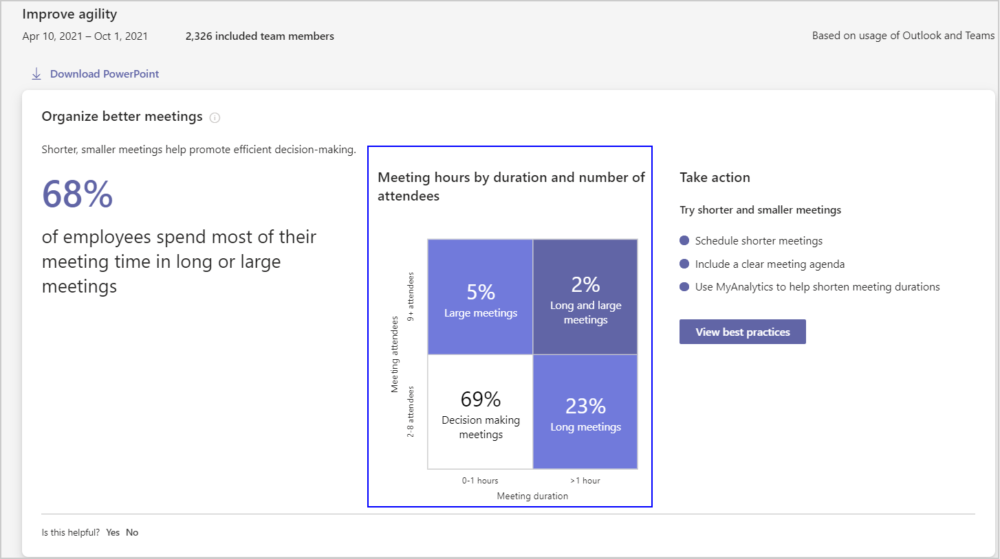

# Improve agility

>[!Important]
>This article is for the legacy Workplace Analytics app and does not reflect functionality available on the updated Viiva Insights platform. Access current documentation for Viva Insights advanced insights here: [Advanced insights documentation](../advanced/introduction-to-advanced-insights.md).

Companies that redefine industries and lead markets are less bureaucratic and nimbly adapt to rapid changes in technology and customer needs. Each of the behaviors listed show how your organization compares with others based on industry research and your specific organizational data.

Microsoft Viva Insights has a **My organization** page that shows leader's collaboration data about their team. The outcomes include data about **Improve agility**.

## Calculations

The following are the percentage insights, their underlying metrics, and a little about the calculations used for them.

|Behavior |Percentage insight | Metrics |Calculations |
|---------|--------|--------------------|----------------------|
|Organize better meetings |Percentage of employees who spend a majority of their meeting time in long or large meetings | [Attendees](/viva/insights/use/metric-definitions?toc=/viva/insights/use/toc.json&bc=/viva/insights/breadcrumb/toc.json#attendees-define), [Attendee meeting hours](/viva/insights/use/metric-definitions?toc=/viva/insights/use/toc.json&bc=/viva/insights/breadcrumb/toc.json#attendee-meeting-hours-define), [Long meetings](/viva/insights/use/glossary?toc=/viva/insights/use/toc.json&bc=/viva/insights/breadcrumb/toc.json.md#long-meeting-define), [Large meetings](/viva/insights/use/glossary?toc=/viva/insights/use/toc.json&bc=/viva/insights/breadcrumb/toc.json#large-meeting-define)| Percentage of employees who spend more than 50 percent of their meeting hours in long or large meetings. The insight is calculated weekly and averaged over the entire time period.  |
|Connect across boundaries |Percentage of employees who could be empowered to make faster decisions | [Influence](/viva/insights/use/metric-definitions?toc=/viva/insights/use/toc.json&bc=/viva/insights/breadcrumb/toc.json#influence-define)  |Employees whose influence score is within 25 percent of their manager's influence score are considered empowered employees. This insight calculates the number of employees who are empowered as compared to all measured employees.  |

The following defines the organizational data shown in the visual behavioral insights.

|Behavior |Visual insight | Definition |
|---------|--------|----------------------|
|Organize better meetings | Meetings by duration and number of attendees | Shows the percentages of meetings that are [long](/viva/insights/use/glossary?toc=/viva/insights/use/toc.json&bc=/viva/insights/breadcrumb/toc.json#long-meeting-define), [large](/viva/insights/use/glossary?toc=/viva/insights/use/toc.json&bc=/viva/insights/breadcrumb/toc.json#large-meeting-define), [long and large](/viva/insights/use/glossary?toc=/viva/insights/use/toc.json&bc=/viva/insights/breadcrumb/toc.json#long-and-large-meeting-define), and [decision-making meetings](/viva/insights/use/glossary?toc=/viva/insights/use/toc.json&bc=/viva/insights/breadcrumb/toc.json#decision-making-meeting-define). |
| Connect across boundaries | Employee's influence relative to their manager | [An organizational network graph](/viva/insights/use/insight-ona-measures?toc=/viva/insights/use/toc.json&bc=/viva/insights/breadcrumb/toc.json) that shows the distribution of employees with similar influence and much lower influence as compared to their managers. This helps identify information sharing patterns, and where they are well represented in your organization. You can use this insight to understand at a high level which parts of your organization could benefit from better information sharing practices. This graph uses the [influence metric](/viva/insights/use/metric-definitions?toc=/viva/insights/use/toc.json&bc=/viva/insights/breadcrumb/toc.json#network-metrics). |

## Best practices

To take action on an outcome, you can select **View best practices** to see a list of recommendations for an insight. This section describes why each of the following behaviors matter and the top best practices that can help improve agility.

* [Organize better meetings](#organize-better-meetings)
* [Connect across boundaries](#connect-across-boundaries)

### Organize better meetings

Shorter, smaller meetings help promote efficient decision-making.

[The condensed guide to running meetings](https://insights.office.com/collaboration/how-to-run-effective-meetings-and-stop-wasting-time/) suggests: "Always set an agenda out ahead of time—and be clear about the purpose of the meeting." Other ways to reduce meeting size or length:

* When composing a meeting invitation with a duration of one hour, note the [inline suggestion](../personal/use/mya-notifications.md#shorten-a-meeting) to shorten the meeting by 15 minutes.
* When preparing the agenda, include the purpose of each participant's attendance. This exercise can reveal unnecessary invitees, including people who are optional or only require meeting notes.

For more best practices, see [Best practices for meetings](../tutorials/gm-meetings.md).

### Connect across boundaries

When employees are free to communicate across organizational hierarchies, it can help promote transparency, avoid miscommunication, and enable smart and timely decision making.

According to [Five ways to empower your team to make decisions](https://insights.office.com/management-strategy/five-ways-to-empower-your-team-to-make-decisions/): “Employee empowerment is directly tied to results. A study by Zenger Folkman found 4 percent of employees are willing to put in more effort when empowerment is low, while 67 percent are willing to go above and beyond when empowerment is high.” Ways to empower decision making:

* Utilize influencers to spread information rapidly and broadly. Engage influencers in communication strategies by asking them to share key information with their networks.
* Use [Teams channels](/microsoftteams/teams-channels-overview) to share information as it emerges both formally through notes and files and informally through chats.
* Provide wide access to [Teams meeting recordings](https://support.microsoft.com/office/record-a-meeting-in-teams-34dfbe7f-b07d-4a27-b4c6-de62f1348c24) and [meeting notes](https://support.microsoft.com/office/add-a-onenote-notebook-to-teams-0ec78cc3-ba3b-4279-a88e-aa40af9865c2) in public channels whenever possible to increase the rate of information sharing.

For more best practices and change strategies, see [Best practices for meetings](../tutorials/gm-meetings.md).

## Related topics

* [Business outcomes overview](/viva/insights/use/insights?toc=/viva/insights/use/toc.json&bc=/viva/insights/breadcrumb/toc.json)
* [Metric descriptions for Viva Insights](/viva/insights/use/metric-definitions?toc=/viva/insights/use/toc.json&bc=/viva/insights/breadcrumb/toc.json)

