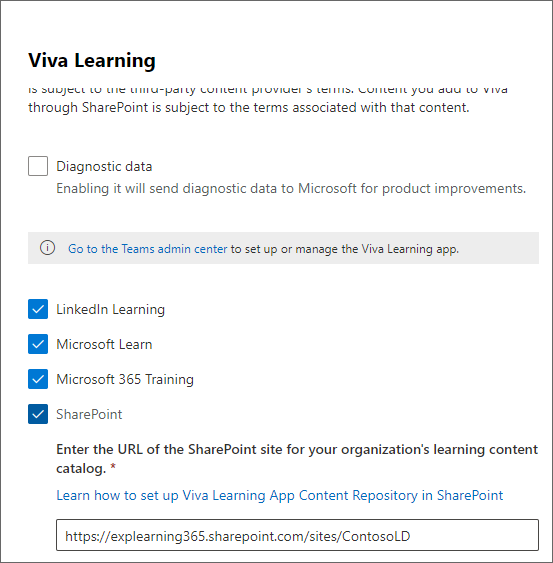
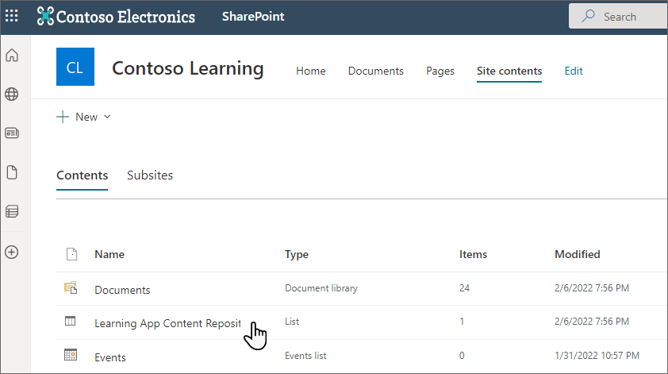
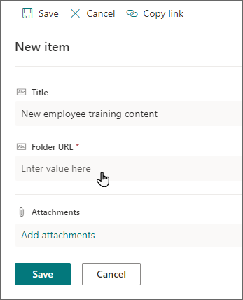
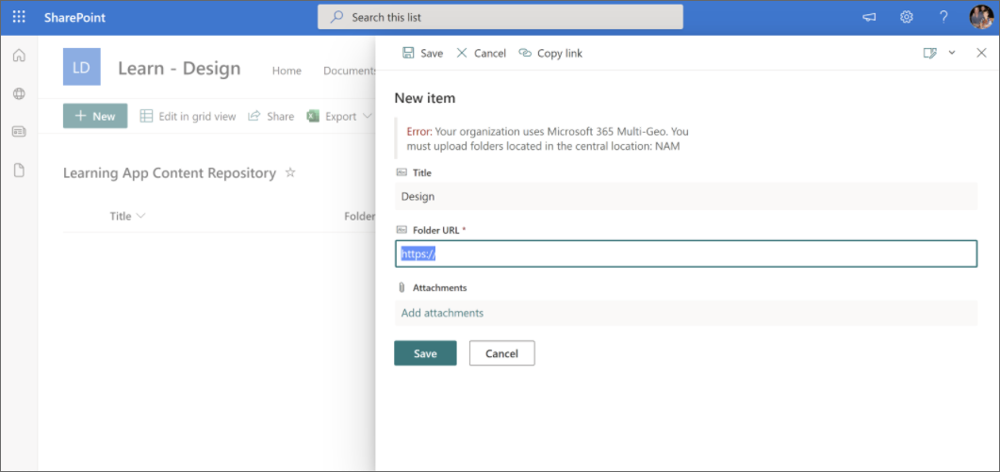
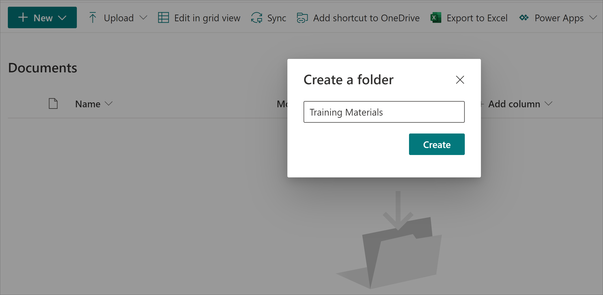
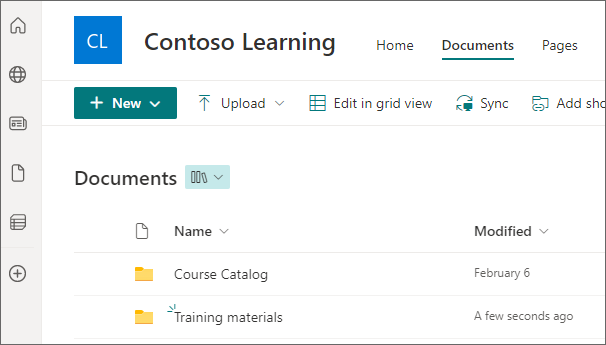
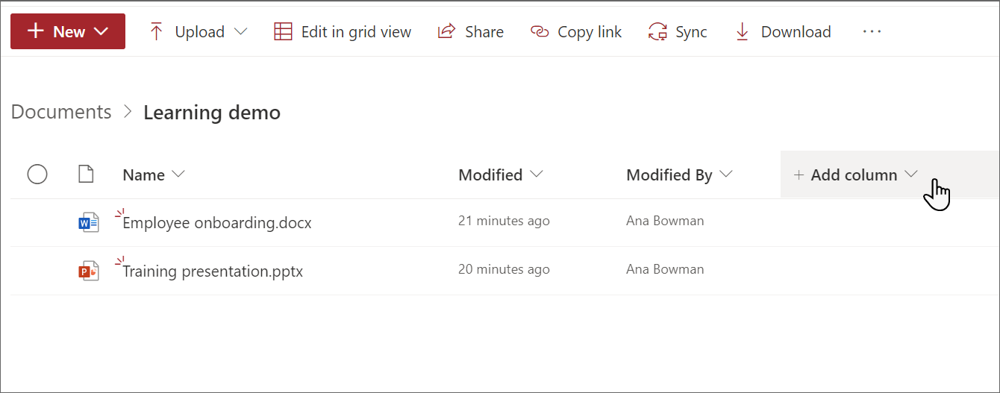
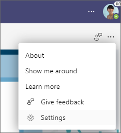
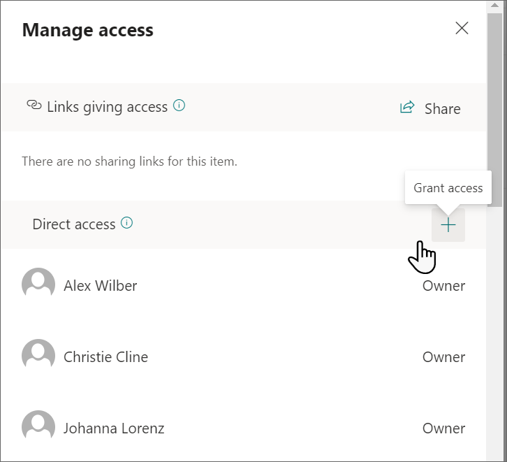
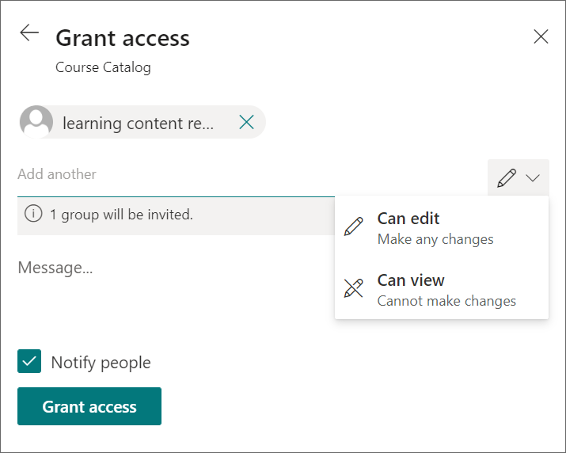

# Add SharePoint as a content source for Microsoft Viva Learning

You can configure SharePoint as a learning content source to make your organization's own content available in Viva Learning.

>[!NOTE]
> Content accessible through Viva Learning is subject to terms other than the Microsoft Product Terms. Any content you add to Viva Learning, such as SharePoint-hosted content, is subject to the privacy and service terms associated with that content.

## Overview

The knowledge admin (or global administrator) provides a site URL to where the [Learning Service](configure-sharepoint-content-source.md#learning-service) can create an empty centralized location in the form of a structured SharePoint list. This list is called the Learning App Content Repository. Your organization can use this list to house links to cross-company SharePoint folders that contain learning content. Admins are responsible for collecting and curating a list of URLs for folders. These folders should only include content that can be made available in Viva Learning.

Viva Learning supports the following document types:

- Word, PowerPoint, Excel, PDF
- Audio (.m4a)
- Video (.mov, .mp4, .avi)

For more information, see [SharePoint limits](/office365/servicedescriptions/sharepoint-online-service-description/sharepoint-online-limits?redirectSourcePath=%252farticle%252fSharePoint-Online-limits-8f34ff47-b749-408b-abc0-b605e1f6d498).

## Learning Service

The Learning Service uses the provided folder URLs to get metadata from all content stored in those folders. Within 24 hours of supplying the folder URL in the centralized repository, employees can search for and use your organization's content within Viva Learning. All changes to content, including updated metadata and permissions, will also be applied in the Learning Service within 24 hours.

## Configure SharePoint as a source

You must be a Microsoft 365 global administrator or knowledge admin to perform these tasks.

To configure SharePoint as a learning content sources in for Viva Learning, follow these steps:

1. In the left navigation of the Microsoft 365 admin center, go to **Settings** > **Org settings**.

2. On the **Org settings** page, on the **Services** tab, select **Viva Learning**.

     

3. On the **Viva Learning** panel, under SharePoint, provide the site URL to the SharePoint site where you want Viva Learning to create a centralized repository. If your SharePoint site is new, you'll need to wait 1 hour after site creation to add it here. You must also be the owner of the SharePoint site.

     

     If your organization uses [Microsoft 365 Multi-geo](/microsoft-365/enterprise/microsoft-365-multi-geo), you can find your region or country at [Microsoft 365 Multi-geo availability](/microsoft-365/enterprise/microsoft-365-multi-geo#microsoft-365-multi-geo-availability). The **Viva Learning** panel also shows this information.

     

4. A SharePoint list is created automatically within the provided SharePoint site.

     In the left navigation of the SharePoint site, select **Site contents** > **Learning App Content Repository**.

     

5. On the **Learning App Content Repository** page, populate the SharePoint list with URLs to the learning content folders.

   1. Select **New** to view the **New item** panel.

       

   2. On the **New item** panel, in the **Title** field, add a directory name of your choice. In the **Folder URL** field, add the URL to the learning content folder. Select **Save**. [Learn how to to create the folder URL](#folder-url-document-library-curation).

       

   3. The **Learning App Content Repository** page is updated with the new learning content.

       

   4. If your organization uses [Microsoft 365 Multi-geo](/microsoft-365/enterprise/microsoft-365-multi-geo) and you try to add a link to a folder that doesn't belong to the central location, you'll get an error message. All folders need to belong to the central location.
       

  > [!NOTE]
  > To allow for broader access to the Learning App Content Repository, a link to the list soon will be available in the Viva Learning interface where users can request access and ultimately help populate the list. Site owners and global administrators will be required to grant access to the list. Access is specific to the list only and does not apply to the site where the list is stored. For more information, see [Provide your own organization's content](#provide-your-own-organizations-content) later in this article.

### Folder URL document library curation

Create a folder to store learning content for your organization.

1. Go to your Documents library and select **+ New**.

    

2. Choose **Folder** and enter a folder name.

    

3. Select **Create**. The folder will now show up in your document library.

    

4. Upload files that you want to publish as learning content in this folder.
5. To get the folder url, choose this folder and select **Copy link**.

    

### Metadata

Default metadata (such as modified date, created by, document name, content type, and organization name) is automatically pulled into Viva Learning by the Microsoft Graph API.

To improve overall discovery and search relevance of the content, we recommend adding columns for description, a thumbnail URL, content duration, content author, and tags. If there's already a description column present, you can delete it and add a new one by following the steps below.

To add a metadata field, follow these steps first.

1. Select the folder from your learning content repository.
2. From the **Documents** page, select **Add column**.

    

To add a description column to the document library page, follow these steps:

1. Follow the initial steps to create a column.
2. Choose **Multiple lines of text**.
3. Name the column ContentDescription.
4. Add custom descriptions for each item. If no description is supplied, Viva Learning will provide a default message that highlights the content as being from your own SharePoint library.

Next, provide a thumbnail image.

1. Follow the initial steps to create a column.
2. Choose **Hyperlink**.
3. Name the column ThumbnailWebURL.
4. If you already have the URLs available, skip to step 8. If you have images stored in SharePoint that you want to use for thumbnails, start with step 5.
5. Go to the document library where your images are stored in SharePoint.
6. Select the image you want to use, then choose **Details**.
7. Choose **Copy link** and select **Copy**.

    

8. Add the URLs for each item.

Next, add the duration of the content.

1. Follow the initial steps to create a column.
2. Choose **Number**.
3. Name the column Duration.
4. Provide the duration of the content in seconds.

Next, add tags.

1. Follow the initial steps to create a column.
2. Choose **Managed metadata**.
3. Name the column SkillTags.
4. Select **More options**.
5. Toggle to allow multiple values.

    

6. You can either choose to use a predefined term set or a customized term set.

[Learn more about how to create a Managed Metadata column.](https://support.microsoft.com/office/create-a-managed-metadata-column-8fad9e35-a618-4400-b3c7-46f02785d27f)

Finally, add the author.

1. Follow the initial steps to create a column.
2. Choose **Multiple lines of text**.
3. Name the column ContentAuthor.
4. Add the author or authors of the content.

### Provide your own organization's content

Knowledge admins can access their organization's Learning App Content Repository in SharePoint, where they can provide references to cross-organization document libraries. Content within these libraries will be then surfaced as learning content in Viva Learning.

1. In Viva Learning, select the ellipses (**...**), and then select **Settings**.

    
  
2. Under **Settings**, select **Permissions**.

    

3. Select **Check access** to connect to your organization's centralized library.

### Delete content

1. Select the content you wish to remove from your Learning App Content Repository.
2. Choose **Delete** on the command bar, or select the ellipses and then select **Delete**.

>[!NOTE]
> Content you delete from the Learning App Content Repository will take approximately 24 hours to be removed from Viva Learning.

## Permissions

Document library folder URLs can be collected from any SharePoint site in the organization. Viva Learning follows all existing content permissions. Therefore, only content for which a user has permission to access is searchable and visible within Viva Learning. Any content within these folders will be searchable, but only content to which the individual employee has permissions can be used.

>[!NOTE]
> Only the Microsoft 365 Groups permissions apply. Viva Learning doesn't support user- or SharePoint-based permissions. Viva Learning won't ingest files that don't have associated Microsoft 365 Groups permissions.

1. Create a group by following the steps in [Create a group in the Microsoft 365 admin center](/microsoft-365/admin/create-groups/create-groups) to create groups in your Microsoft 365 admin center.

>[!NOTE]
> While only **Microsoft 365 (recommended)** and **Mail-enabled security** group types are supported, it is recommended that you use **Microsoft 365 (recommended)**.

>[!NOTE]
> You'll need to add the owners as members in order for them to have access.

2. Go to the learning content repository that you created in SharePoint.
3. Select the vertical ellipses (**...**) on the item you want to control access to. If you want to control access to specific items in a folder, go to that folder.
4. Select **Manage access**.

    

5. Select the plus icon (**+**) next to **Direct access**.

    

6. Start typing the email address of the group you want to give access to, then select the group.

    

7. By default, users in the group are given Edit permissions. Select the pencil icon to choose between Edit and View permissions. The pencil icon will have a slash through it if the group has only view permissions.

    

8. Select **Grant access** to give your group access to the learning content.

>[!NOTE]
> It will take approximately 24 hours for these changes to show up in the Viva Learning app.

To remove unintentionally surfaced content, follow these steps:

1. To restrict access to the document library, select the **Show actions** option, and then select **Manage access**.

     

2. Delete the original document within the document library.

For more information, see [Sharing and permissions in the SharePoint modern experience](/sharepoint/modern-experience-sharing-permissions).

## Multi-geo

If you're using [Microsoft 365 Multi-geo](/microsoft-365/enterprise/microsoft-365-multi-geo), the site URL provided by the knowledge admin (where the Learning App Content Repository will be located) needs to belong to the central location where your Microsoft 365 subscription was originally provisioned. Folders linked to in the repository should also belong to the central location. Viva Learning has added this restriction to conform to data residency requirements.

[Microsoft 365 Multi-geo](/microsoft-365/enterprise/microsoft-365-multi-geo) is designed to meet data residency requirements. For more information, see [Multi-geo capabilities in SharePoint Online](/microsoft-365/enterprise/multi-geo-capabilities-in-onedrive-and-sharepoint-online-in-microsoft-365).

## Next steps

[Add learning management systems for Viva Learning](configure-lms.md) or [Add other content providers for Microsoft Viva Learning](configure-other-content-sources.md).
