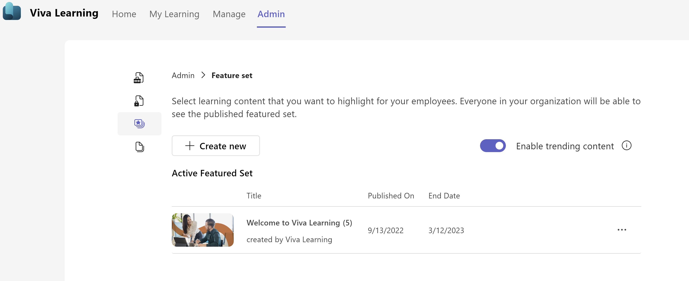
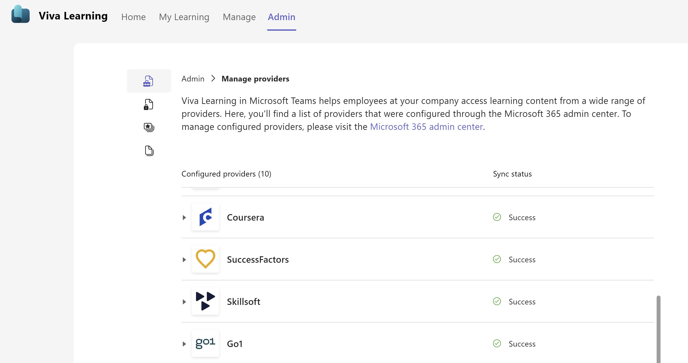

# Manage content in the admin tab

You can manage some of your Viva Learning content from within the app in Teams. Use the **Admin** tab to control Viva Learning configurations and different features. This requires knowledge manager access.  

>[!NOTE]
> Some features in the Admin tab require a Viva Suite or Viva Learning license.

Review this article to [Learn how to assign roles](/exchange/permissions/role-group-members).

To create a set of featured content that will show up for your users, select the **Create featured set** in the top left corner.

## Managing Providers

Navigate to **manage providers** for a detailed view of all configured learning providers and to manage the learning providers and respective offerings. Refer to [Manage learning management systems](../learning/configure-lms.md) and [Add other content providers](../learning/configure-other-content-sources.md) for more information.

Once a learning provider is configured at M365 Admin center, it automatically flows into manage providers tab. You can track the sync status for content and learner record sync for specific providers and keep track of log files.

>[!NOTE]
> Set up the learning provider and manage content sources for Microsoft Viva Learning in the Microsoft 365 Admin center.

Track the current sync status, last successful sync time, ingestion logs, and trigger full sync for each component in the expanded view:

- **Sync status**: Check the current sync status (success/failed/in progress). You can also refer to the timestamp value for last successful sync time.

- **Export log**: After a sync and ingestion of learning records to substrate, you can refer to the “export log file” for more details about successful or failed ingestions at learning object level.

- **Trigger full sync**: Trigger the full sync manually. Once a full sync is triggered, the current sync status will be updated accordingly.

- **Manage Learner record sync**: Manage the learner record sync using the toggle button and keep track of the respective sync status. The availability of this functionality is dependent on the learning provider.

- **Manage permissions**: Use the toggle for turning the sync on or off to manage the permission for a particular provider. The availability of this functionality is dependent on the learning provider.

## How content shows up in the My Learning page

The My Learning tab helps users take control of their learning journey. Users will be able to track assignments, recommendations, bookmarks, recent history, and completed courses on this page.

-**Recommended to you**: Recommendations from your peers will show up here.

-**Bookmarks**: Content bookmarked by the user will be shown here.

-**Recently viewed**: The user's 20 most recently viewed items will be shown under this tab. The most recently viewed item is shown first.

-**Completed**: Courses completed by the user will show under this tab.
