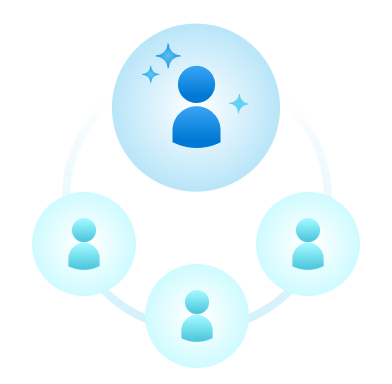
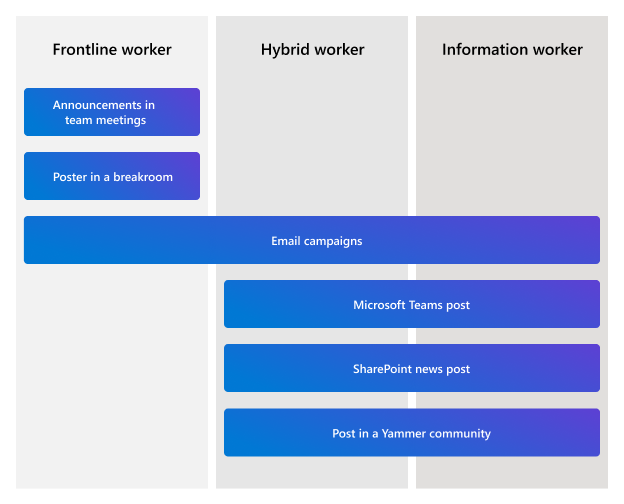

# Get all Microsoft Viva modules

[Microsoft Viva](https://www.microsoft.com/microsoft-viva) currently offers four modules that can make an impact on their own and become even more powerful when used together. Learn more about [individual Viva modules](discover-more-about-each-viva-module.md) and how you can use [two or more modules together](learn-how-to-combine-modules.md) to create personalized employee experiences for your organization.

Follow the guidance in this article if you know your organization wants all four Viva modules.

|:::image type="icon" source="media/viva-confirm-licensing.png" border="false":::   Step 1  |:::image type="icon" source="media/viva-requirements.png" border="false":::   Step 2 |:::image type="icon" source="media/viva-learn.png" border="false":::   Step 3 | :::image type="icon" source="media/viva-prepare.png" border="false":::   Step 4|
|:---------:|:---------:|:---------:|:---------:|
|Confirm you’ve got the right licensing in place. |Meet technical requirements.|Learn more about the roles in each phase.|Prepare to launch and scale adoption with end-users.|

## Step 1: Confirm the right licensing is in place

To get all four Viva modules, you'll need a license for Microsoft 365 or Office 365 (E1, A1, G1, E3, A3, G3, E5, A5, G5), Microsoft 365 Business Basic, Business Standard, Business Premium, or Exchange Online Plan 1 or Plan 2 to be eligible for Microsoft Viva.

Then, you need to purchase the [Microsoft Viva suite](https://www.microsoft.com/microsoft-viva/pricing?rtc=1) that includes:

- Viva Insights to improve employee and team productivity and wellbeing.
- Viva Learning (premium version) for employee skilling and growth.
- Viva Topics for organization and discovery of knowledge and expertise.

## Step 2: Meet technical requirements

After you’ve got the right licensing in place, review additional requirements to get the Viva module up and running. For more details, [review minimum requirements and planning considerations](discover-more-about-each-viva-module.md).

|:::image type="content" source="media/logos/connections-launch-c-64.svg" alt-text="connection":::   Viva Connections  |:::image type="content" source="media/logos/insights-launch-c-64.svg" alt-text="insight":::   Viva Insights  |:::image type="content" source="media/logos/learning-launch-c-64.svg" alt-text="learning":::   Viva Learning  |:::image type="content" source="media/logos/topics-launch-c-64.svg" alt-text="topics":::   Viva Topics  |
|:---------:|:---------:|:---------:|:---------:|
|- SharePoint home site   - Global navigation enabled and customized   - Modern SharePoint sites|No technical requirements besides licensing for personal and team insights.|- A Microsoft Teams team  (if you're creating a learning tab in Teams). 
 - Modern SharePoint to connect internal resources to Viva Learning. |No technical requirements besides licensing.|

## Step 3: Get guidance on roles for each phase

Review the different roles in each phase before you get started planning. Each module needs a few key roles that will help ensure success throughout the planning, building, and launching phases.

|  |Coordinate and plan  |Build  and set up |Deploy and launch |
|---------|---------|---------|---------|
|**Viva Connections**|Work with **your organization’s stakeholders** and business partners (from groups like HR, communications specialist, and technology advocates) to identify the most valuable workflows and tasks that can be completed in Viva Connections.|- The **SharePoint admin** will set a home site (if you don’t already have one) in the admin center. SharePoint admins may also help modernize classic SharePoint sites and pages where needed. 
 - The **Microsoft Teams admin** will add your organization’s version of Viva Connections as an app and choose settings in the Teams admin center. 
 - **Site owners and authors for the home site** will design the home site content, navigation, and the Dashboard. 
 - Additional **site owners and authors** may be involved to update content or news post that will be relevant to the Viva Connections experience.| - Collaborate with **champions** (early adopters) to help other people at the organization adopt Viva Connections.
 - Leverage **executive sponsors** who can help evangelize Viva Connections at large company meetings and in broad communications. 
  - **Business owners (like HR) and managers** at all levels can help teams and individuals find value and adopt new ways of working. |
|**Viva Insights**|Work with your **organization’s stakeholders** and business partners to identify who does what to get Viva Insights set up, introduced, and adopted within the organization.|- **Microsoft 365 enterprise or global admin** [assigns licenses](insights/personal/Setup/configure.md), [assigns roles](insights/Setup/Assign-roles-to-wpa-admins.md), and [configures app access](insights/personal/Setup/configure.md). 
 - **Insights Administrator** then works with the enterprise or global admin to [set up advanced insights](insights/Setup/Set-up-Workplace-Analytics.md) and the **Microsoft Teams Service Administrator** to [deploy the Viva Insights app in Teams](insights/personal/teams/viva-teams-app-admin-tasks.md).|After app access is set up, the admin and business leaders can then plan a rollout strategy for introducing Viva Insights to their organization. For rollout ideas, see [Roll out Viva Insights and Conduct a user pilot](insights/personal/Setup/deployment-guide.md) (Briefing emails).|
|**Viva Learning** |- Work with **Business leaders** and **HR** in your organization to define learning goals. 
 - Find out if any third-party content sources or learning management systems you’re already using can integrate with Viva Learning.|- The **Microsoft 365 global admin, SharePoint admin**, or **Knowledge admin** chooses which content sources to use in the Microsoft 365 admin center. 
 - The **Microsoft 365 global admin**, **Knowledge admin**, or **Knowledge Manager** uses the admin tab in Viva Learning to [choose how content shows up for your organization](learning/use-tabs.md). 
 -The **Microsoft Teams admin** can enable or disable Viva Learning from the Teams admin center (Viva Learning is enabled by default). 
 - The **Microsoft 365 global admin** or **Knowledge admin** can [create a Learning App Content Repository in SharePoint to integrate with Viva Learning.](learning/configure-sharepoint-content-source.md)|- **Managers** can [recommend learning content](https://support.microsoft.com/office/recommend-and-manage-content-in-viva-learning-77f9dcbf-41a8-4b19-b4d1-b99c406f37b8) to their teams, and **Team members** can share content with each other. 
 - **Managers** and **Subject matter experts** can create custom learning content that the **Microsoft 365 global admin** or **Knowledge admin** can add to the Learning App Content Repository in SharePoint.|
|**Viva Topics** | - **Stakeholders, knowledge managers, communications leads, champions**, and **topic contributors** make up your core knowledge team. 
 - **Core team** selects a rollout approach, identifies, and prioritizes scenarios, ensures technical and business readiness, and develops a communications plan.|- **Microsoft 365 global admin** or **SharePoint admin** sets up Viva Topics and configures settings in the Microsoft 365 admin center. 
 - **Knowledge managers** manage topics in the topic center, including reviewing AI-suggested topics, confirming topics are valid, removing topics that you don’t want visible to users, and editing existing topics or creating new topics. 
 - **Topic contributors** edit existing topics or create new topics.|- **Corporate communications leads** use various communication channels to announce Viva Topics. 
 - **Champions and core team** can help spread awareness through engagements and training events.|

## Step 4: How to get started

Technically, the Viva modules do not need to be installed in a specific order. Insights and Learning require less time to get going, Connections and Topics takes longer to plan and customize.

|Connections  |Insights  |Learning  |Topics |
|---------|---------|---------|---------|
|- Create a Viva Connections Dashboard with cards. 
 - Target cards to specific audiences. 
 - Prepare content for the Feed and Resources. 
 - Upload the app to the Teams admin center. 
 - [Review the getting started guide for Viva Connections.](connections/guide-to-setting-up-viva-connections.md)| - Decide which types of insights are needed ([personal](insights/personal/introduction.md), [manager](insights/Use/myteam.md), [leader](insights/Use/viva-insights-my-org.md), and [advanced](insights/index-orig.md)). 
 - [Review the getting started guide for Viva Insights.](insights/Setup/setup-intro.md)|- [Choose which learning content sources to use.](learning/content-sources-365-admin-center.md) 
 - [Manage how content shows up for your org.](learning/use-tabs.md) 
 - [Review the getting started guide for Viva Learning.](learning/set-up-viva-learning.md) | - Choose which SharePoint sites you want to crawl for topics. 
 - Identify which topics, if any, you want to exclude from topic experiences. 
 - Choose which users you want to make topics visible to. 
 - Identify which users you want to give permissions to manage topics or to create or edit topics in the topic center. 
 - Choose the name that you want to give your topic center. 
 - Review the [Get your environment ready](topics/topic-experiences-get-ready.md) and [Set up Viva Topics](topics/set-up-topic-experiences.md) guidance.|

## Step 5: Prepare to launch and scale adoption with end-users

All four Viva modules don't need to be launched at the same time to be useful to your organization. Consider a phased approach based on the modules that are available, the most valuable to your organization, and which modules will be the most useful and appealing to specific audiences.

**Leverage champions and early adopters**: A champion will create a center of enthusiasm that grows adoption, build a circle of influence among their teams, identify business challenges and possible solutions, provide feedback to the project team and sponsors, and reduce strain on the core project team through active, ongoing engagement.

Learn more about [how to build a champion program at your organization.](https://view.officeapps.live.com/op/view.aspx?src=https%3A%2F%2Fadoption.microsoft.com%2Ffiles%2Fchampions%2FChampion-Program-Plan-Template.pptx&wdOrigin=BROWSELINK)

**Meet your audience where they are**: There are several methods of sharing the availability of the Viva modules like email, SharePoint news, or post in Teams or a Yammer community for example. [Get more information, templates, and resources to help your organization promote and adopt Microsoft Viva.](https://adoption.microsoft.com/viva/)

Consider where and how different audiences currently get news and announcements. For example, frontline workers might get the most important news in team meetings and from posters in break rooms, and hybrid workers might be used to getting SharePoint news in Outlook. Consider using the following methods to reach your audience:

- **Announce your organization’s instance of Microsoft Viva at an event**: Kick off the announcement about the availability of the modules at an all-hands (or sometimes called a Town Hall) meeting where everyone in the organization will attend or can view a recording later.
- **Use communication tools like SharePoint news and Yammer communities**: Share details about the launch along with any change management guidance or end-user training in an [organizational news post](https://support.microsoft.com/office/create-and-share-news-on-your-sharepoint-sites-495f8f1a-3bef-4045-b33a-55e5abe7aed7#:%7E:text=In%20SharePoint%20Online%2C%20you%20can%20add%20news%20posts,instructions%20Create%20the%20news%20post%20.%20See%20More), [Yammer communities](https://support.microsoft.com/office/start-a-conversation-in-yammer-da65b1c3-6651-4141-8dbd-d50d61b98a6e), and [Microsoft Teams channels.](https://support.microsoft.com/office/create-and-format-a-post-e66777da-636b-49eb-9408-b0d88b212885)
- **Consider hosting training events or offering office hours**: Make sure end-users get the most from Viva by offering ongoing support the first 30 days after launching.
- **Use the Viva email and poster templates**: Get a jump start on creating [communication materials for the Viva Connections launch.](https://adoption.microsoft.com/viva/)

## Learn more

[Microsoft Viva – Microsoft Adoption](https://adoption.microsoft.com/viva/)

[Microsoft Viva Overview | Microsoft Docs](microsoft-viva-overview.md)

[Combine Microsoft Viva modules for a more powerful experience](learn-how-to-combine-modules.md)
