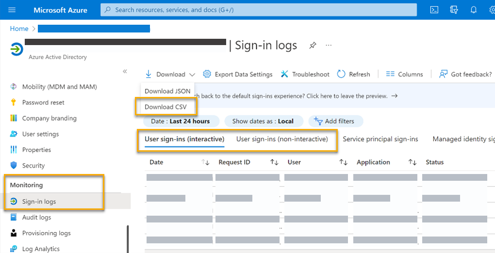
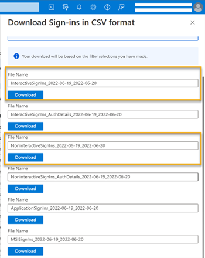
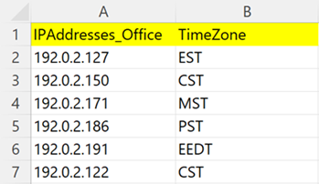

# Step 1. Generate source files

In this step of the Hybrid workforce experience OnsiteDays solution, you'll:

> [!div class="checklist"]
>
> * Download interactive and non-interactive event logs from Azure AD  as .csv files.
> * Create an office IP address list.

## Event logs

The first source files you'll need to generate are event logs. which need to be downloaded as .csvs. To do so:

1. Sign in to the [Azure portal](https://portal.azure.com/#home) and navigate to Azure AD.

    

1. Navigate to **Monitoring > Sign-in logs > User sign-ins (interactive) > Download CSV.** Do the same for non-interactive sign-ins: **Monitoring > Sign-in logs > User sign-ins (non-interactive) > Download CSV**.
    

    

Your output file will resemble the following image:

### About Azure Active Directory sign-ins 

While this solution only requires you to download the sign-in files detailed earlier, here’s some background information about Azure AD sign-ins:

* Interactive and non-interactive sign-ins: When a user signs in to any application configured for Azure AD (for example, Office or Teams), a sign-in event is logged. That event is an “interactive” sign-in and can be accessed under **User sign-ins (interactive)** in Azure. As long as the user leaves that application open, a refresh-token event is logged every 60-90 minutes. That refresh-token event is a “non-interactive” sign-in and can be accessed under **User sign-ins (non-interactive)** in Azure.
* You can configure the lifetime of the access token.
* You can access sign-in events that are up to 30 days old and export them as .json or .csv files.

This article provides a more in-depth look at sign-in logs: [Sign-in logs in Azure Active Directory - Microsoft Entra](/azure/active-directory/reports-monitoring/concept-sign-ins).

## Office IP addresses list

The next source file you need to create is the office IP address list. You’ll need to generate a list of office IP addresses and include the time zone associated with each IP address. 

Here is a two-column [sample file](https://github.com/microsoft/VivaSolutions/blob/main/Sample%20Solutions/HW_OnsiteDays/IpAddresses.xlsx), which you can download, update with your data, and use in the template described later in this article. 

For the:

* IPaddresses_office (column A): List the IP address associated with each office location.
* TimeZone column (column B): Add the time zone based on the geolocation of the IP address in column A.

>[!Important]
> Use the time zone abbreviations provided in **TimeZoneData** sheet of the template. Using these abbreviations will standardize your data and the transformations steps will accurately determine the user’s local time zone. Discrepancy in time zone standards will cause inaccurate results.
>
>For example, the **TimeZoneData** sheet has “EST” for Eastern Standard Time (North America). If you update the **TimeZone** value to “ET” instead of “EST,” the results would be inaccurate.
>
>

> [!div class="nextstepaction"]
> [Next up: Use the automated OnsiteDays template](hybrid-workforce-experience-template.md)