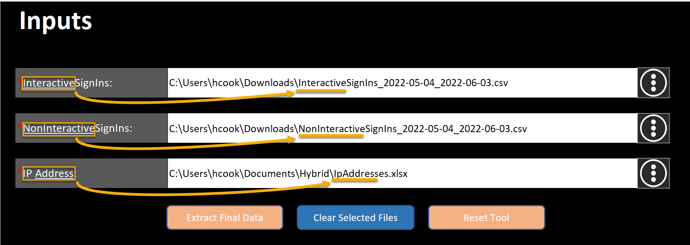
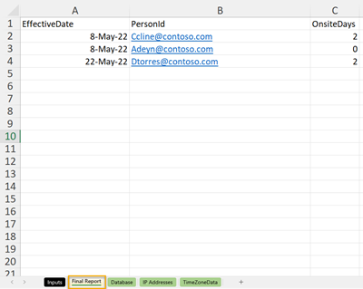

# Step 2. Use the automated OnsiteDays template

In this article, you'll:

> [!div class="checklist"]
>
>* Learn how the OnsiteDays Excel template is organized and what it contains.
>* Use the OnsiteDays Excel template to generate the **OnsiteDays** attribute.

Now that you’ve prepared your source files, you’re ready to start using the template. In this section, we’ll discuss what the template contains and how to use it. You can download the template [here](https://github.com/microsoft/VivaSolutions/blob/main/Sample%20Solutions/HW_OnsiteDays/HW_OnsiteDaysTemplate.xlsb). 

## Template structure

The template contains the following sheets: 

* **Inputs**: This sheet accepts the source files required to generate **OnsiteDays** for each user. You’ll upload the required .csv files here, as described in the next section.

    [Creating source files](hybrid-workforce-experience-source-files.md) provides guidance on creating the Azure event log files.

* **Final Report**: This sheet provides the data with **PersonID**,**EffectiveDate**, and **OnsiteDays** attributes, which will be either uploaded or appended to an existing organizational data file. You don’t need to perform any actions in this sheet.

* **Database**: This sheet performs all the transformations required to determine **OnsiteDays** from interactive and non-interactive .csv file data you upload in the **Inputs** sheet. You don’t need to perform any actions in this sheet.

* **IP Addresses**: This sheet populates the data from the IP address file you upload in the Inputs sheet. You don’t need to perform any actions in this sheet.

* **TimeZoneData**: This sheet auto-populates with the metadata of all the time zones and offsets, which is used to convert UTC datetime to users’ local datetime. This data is used to transform dates in database sheet. You don’t need perform any actions in this sheet.

## How to use the template

1. Open the [template](https://github.com/microsoft/VivaSolutions/blob/main/Sample%20Solutions/HW_OnsiteDays/HW_OnsiteDaysTemplate.xlsb).
2. If a security warning appears, select **Enable content**. 
    

### Upload files

3. In the **Inputs** sheet, in their respective file attributes section, upload the .csv files for the interactive and non-interactive event logs generated from Azure AD, as well as the IP addresses list.

    >[!Important]
    > Don’t alter any columns or attributes that are downloaded from Azure AD.
    
#### About file names 

Each file name needs to include the keyword that’s underlined in the file attribute field, beneath “Inputs.” Including the right keyword makes sure the correct file is being uploaded. Failing to comply with this naming standard will result in a wrong-file error. Specifically:

* **InteractiveSignIns**: This field accepts the interactive sign-in .csv file you generated in Creating source files. Make sure the file name contains the underlined keyword, which is “Interactive.” 
* **NonInteractiveSignins**: This field accepts the non-interactive sign-in .csv file you generated in [Creating source files](hybrid-workforce-experience-source-files.md). Make sure the file name contains the underlined keyword, which is “NonInteractive.”
* **IP Address**: This field accepts the list of office IP addresses you generated in Creating source files. Make sure the file name has underlined keyword, which is “Address.”

    

### Extract data

4.	Select the **Extract Final Data** button. When you select this button, the template performs all the transformations and loads data to **Database** sheet and **Final Report** sheet. **Final Report** provides **OnsiteDays** aggregated by user per week, and it can be uploaded or appended to an existing organizational data file to generate the Hybrid workforce experience Power BI report.

    

#### About other buttons on the Input sheet

There are two other buttons on the Input sheet:

* If you’ve uploaded files but haven’t yet pressed **Extract Final Data**, the **Clear Selected Files** button clears existing file entries. You can then upload another set of interactive, non-interactive, and IP address files.
* If you’ve already pressed the **Extract Final Data** button, but you need to generate data from other source files, the **Reset Tool** lets you start from scratch. This button resets the data from all the sheets.

### Generate the Hybrid workforce experience Power BI report

Now that you've created the **OnsiteDays** attributes, you're ready to use the Hybrid workforce experience Power BI report template. In addition to **OnsiteDays**, you'll also need to upload the other two required attributes as part of your HR data—**SupervisorIndicator** and **HireDate**.

The next article guides you through running the required query in Workplace Analytics, then downloading and using the Power BI template. For more details on the data-upload process, you can refer to a [step-by-step guide](https://go.microsoft.com/fwlink/?linkid=2195632).

> [!div class="nextstepaction"]
> [Next up: Generate the Hybrid workforce experience Power BI report](../insights/Tutorials/hybrid-workforce-experience.md)