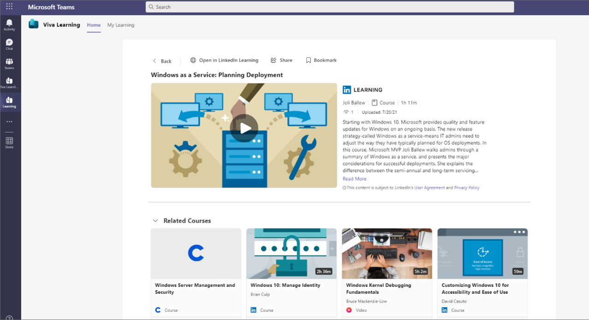
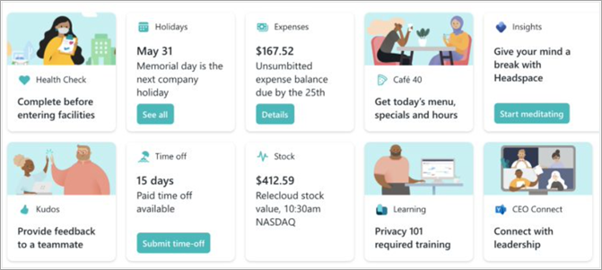

# Onboarding employees who are new or changing roles

Your organization is hiring, and you need to onboard new employees – some who work in the office and some who work remotely. You may also have employees who are changing roles within the organization and need to ramp up quickly and learn about their new roles. It's essential to streamline the onboarding process and make it easy for people to find consolidated information and know what actions to take as they onboard to the company or begin a new role. Here are some ways you can use Microsoft Viva to help every employee onboard successfully.

| Viva Learning | Viva Topics | Microsoft Stream | Viva Insights | Viva Connections | Viva Engage |
---|---|---|---|---|---|
 | Target specific training for new employees. | Help new team members learn about popular terms, acronyms, projects, and more. | Use videos for training and onboarding. Stream company events. | Help new team members spend time productively. | Provide new employees with easy access to benefits, training materials, and resources. | Give new employees a place to connect and engage with leaders, colleagues, and communities.|

**Roles for this scenario**: Human Resource specialists, knowledge admins, and SharePoint admins, site owners and page authors

 
### Viva Learning

Learning is one of the most important aspects of onboarding new employees. Using Viva Learning can help provide new employees with targeted training wherever they are. You can provide your own learning materials, such as learning about your organization’s culture and processes, building skills, and more.

Viva Learning is enabled by default for all Microsoft Teams users in your organization. You can turn off or turn on Viva Learning at the organization level on the Manage apps page in the Microsoft Teams admin center. To learn more, see [Set up Viva Learning](/viva/learning/set-up-viva-learning).

Create and deploy custom learning for your organization by adding SharePoint as a learning source for Viva Learning. You can create and add your own organization’s training materials to Viva Learning. The knowledge admin (or global administrator) provides a site URL to where the Learning Service can create a centralized location in the form of a structured SharePoint list. This list is called the Learning App Content Repository. Your organization can use this list to house links to cross-company SharePoint folders that contain learning content. See the [step-by-step guide](/viva/learning/configure-sharepoint-content-source) on how to do this.

### Viva Topics

Viva Topics helps to address a key business issue in many companies — providing the information to users when they need it. For example, new employees need to learn a lot of new information quickly, and encounter terms they know nothing about when reading through company information.

When a topic is mentioned in content on SharePoint news and pages, you'll see it highlighted. You can open the topic summary from the highlight. Open the topic details from the title of the summary to view the full topic page. The mentioned topic could be identified automatically or could have been referenced directly by the page author.

**How to create topics**

You must be a global administrator or SharePoint administrator to set up and manage topics. Admins can designate users who can create and edit topics. For more information, see [Set up Microsoft Viva Topics](/viva/topics/set-up-topic-experiences) and [Manage topic permissions in Microsoft Viva Topics](/viva/topics/topic-experiences-user-permissions).

### Microsoft Stream
Microsoft Stream
Use Microsoft Stream to record training and information provided by your executives, your HR department, or anyone who needs to address new employees. Videos will appear on the [Stream start page](/stream/streamnew/start) on Office.com. You can also promote these videos in a [SharePoint news post](https://support.microsoft.com/en-us/office/create-and-share-news-on-your-sharepoint-sites-495f8f1a-3bef-4045-b33a-55e5abe7aed7) as well as Teams and Yammer, and also your Viva Connections feed. Learn more about [Stream](/stream/streamnew/start).

### Viva Insights

Help new team members understand how to spend time productively and help managers provide better guidance on time management. Learn more about Viva Insights and how it helps protect and organize time in [Supporting work/life balance](/Viva/solutions/viva-work-life-balance)

### Viva Connections

Bring together Learning, Insights, and Stream in Viva Connections by adding cards for these apps and services to your Viva Connections dashboard. Learn more in [Viva Connections Dashboard](/viva/connections/create-dashboard).

### Viva Engage

Help new employees get up to speed quickly by using Viva Engage to connect with people across the company, no matter where they work. They can connect and engage with leaders, colleagues, and employee communities. Engage also helps new employees discover virtual events and conversations where they can ask questions, make new contacts, and start building their network. Learn more in [Introducing Viva Engage](/viva/engage/overview).

<iframe width="560" height="415" src="https://www.youtube.com/embed/E_xTiWClwYc" title="YouTube video player" frameborder="0" allow="accelerometer; autoplay; clipboard-write; encrypted-media; gyroscope; picture-in-picture" allowfullscreen></iframe>

**Next**: Learn how to support [frontline workers with Microsoft Viva](/Viva/solutions/viva-front-line-workers).
 