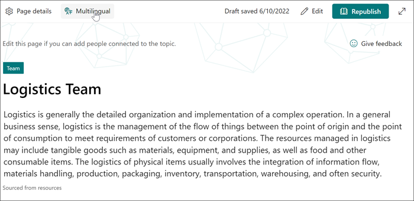
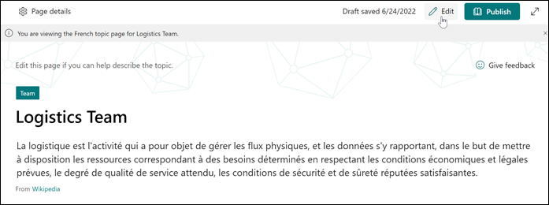

# Curate an existing topic using multilingual in Viva Topics 

In Viva Topics, you can use the multilingual feature to curate and edit a topic page in English, French, German, and Spanish.

> [!Note] 
> A topic page must be created and curated in the tenant's default language before it can be translated using the multilingual feature in Viva Topics. 

## Curate a multilingual topic page

> [!Note] 
> When translating a topic page using the multilingual feature in Viva Topics, editing field intructions will be in the default language from your tenant. To change this, update your tenant's language settings.

To edit a topic, open the topic page from a topic highlight, and select the **multilingual** on the topic page. The topic page can also be opened from the topic enter home page where you can find all the topics you're connected to.

   

1. Under the multilingual panel, find the desired language and select **create**.

     

2. The multilingual panel will confirm when the new multilingual page is created. Select **view** to open and edit the multilingual page.

     

3. To edit the multilingual topic page, select **edit** on the top right of the multilingual topic page.

     

     Make sure you're in the correct topic page by looking at the notification banner that will appear on the top left of the page.

     

4. Confirm or edit the topic name on the multilingual topic page.

     

5. In the **context hint** section, add a hint relevant to the current topic in the selected language.

     

6. In the **alternative names** section, add other names for the topic in the selected language.

     

7. In the **short description** section, describe the topic in the selected language.

     

> [!Note] 
> When editing the multilingual page, there are editing fields you can only edit in the default language topic page. Field available to edit in the default language topic page include:
    - Confirmed people
    - Pinned files and pages
    - Related sites
    - Related topics
   To edit these fields, save or **publish** your changes on the multilingual topic page and visit the topic's default language page and continue [editing](./edit-a-topic.md) if needed.

## Select a curated multilingual topic page
To select a published multilingual topic page, go to the topic's default language page and choose a language option on the top right menu of the topic page.

