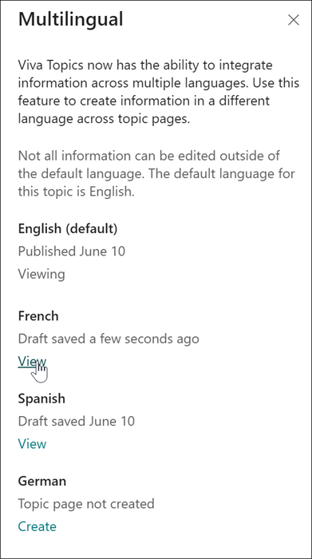
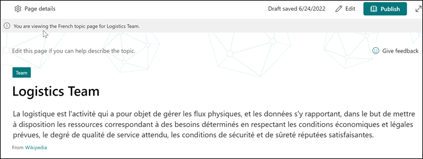

# Translate an existing topic using Multilingual in Microsoft Viva Topics

In Viva Topics, you can use the Multilingual feature to curate and edit a topic page in English, French, German, and Spanish.

> [!Note] 
> A topic page must be created and curated in the tenant's default language before it can be translated using the Multilingual feature in Viva Topics. 

## Curate a Multilingual topic page from an existing topic

> [!Note] 
> When translating a topic page using the Multilingual feature in Viva Topics, editing field instructions will be in the default language from your tenant. To change this, update your tenant's language settings.

To create a multilingual topic page, open a topic page, and select **Multilingual** on the upper-left of the topic page. The topic page can also be opened from the topic center home page or from a topic highlight in your tenant.

   

1. Under the Multilingual panel, find the desired language and select **Create**.

     

2. The Multilingual panel will confirm when the new Multilingual page is created. Select **View** to open and edit the Multilingual page.

     

3. To edit the newly created Multilingual topic page, select **Edit** on the command bar on the topic page.

     

     Make sure you're in the correct topic page by looking at the notification banner that will appear on the upper-left of the page.

     

4. Confirm or edit the topic name on the Multilingual topic page.

     

5. In the **Context hint** section, add a hint relevant to the current topic in the selected language.

     

6. In the **Alternative names** section, add other names for the topic in the selected language.

     

7. In the **Short description** section, describe the topic in the selected language.

     

> [!Note] 
> When editing the Multilingual page, there are fields you can only edit in the default language topic page. Fields available to edit in the default language topic page include: Confirmed people, Pinned files and pages, Related sites, and Related topics.
   To edit these fields, save or publish your changes on the Multilingual topic page and visit the topic's default language page and continue editing if needed.

## Select a curated Multilingual topic page
To view a published Multilingual topic page, select a language option on the upper-right language menu of the topic page.

