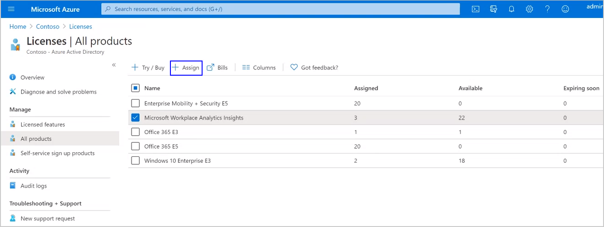
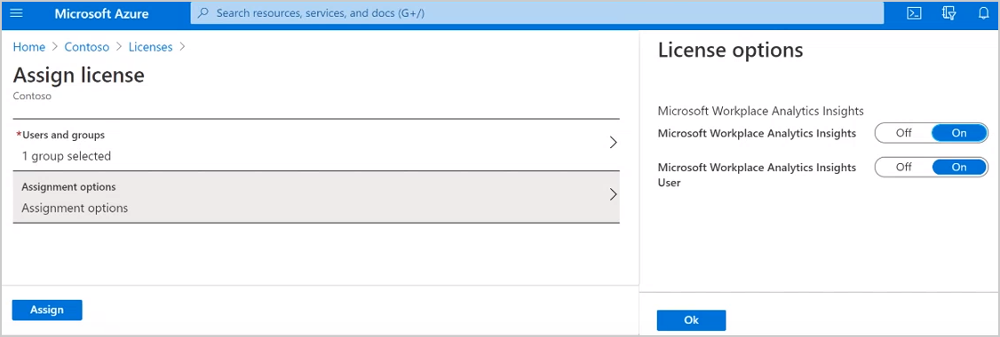

# Set up Workplace Analytics insights

*This experience is only available through private preview at this time.*

Before people in your organization can view and use Workplace Analytics insights, your Microsoft 365 global admin needs to do the following for them: 

* [Activate licenses](#activate-licenses)
* [Assign licenses](#assign-licenses)
* [Assign the role of Insights Business Leader](#assign-roles)

This new release is currently limited to Microsoft or Office 365 E5 or E3 plan subscribers through their Microsoft service representative.

You can request access and get more information at [Microsoft Workplace Analytics](https://www.microsoft.com/microsoft-365/business/workplace-analytics). Select **Contact us** and complete the form to request access and get more information about Workplace Analytics insights.

## Activate licenses

1. Depending on which browser you are using, on the Windows taskbar or Start menu, right-click the browser application and select **Start InPrivate Browsing**, **New InPrivate window**, **New incognito window**, or **New private window**.
2. Copy the **activation code link** that Microsoft sent you for Workplace Analytics insights, paste it into the URL section of the private or incognito browser window, and then press **Enter** to open the link.

   

3. When prompted, enter your email address.
4. Sign in with your Microsoft or Office 365 global admin credentials, and then select **Next**.
5. In **Check out** > **confirm you order** > **Microsoft Workplace Analytics insights trial**, select **Try now**.
6. When prompted in **order receipt**, select **Continue**.

## Assign licenses

You must be able to sign in as a global Microsoft 365 admin to use the Microsoft admin center to assign licenses to one or more individual users who subscribe to Microsoft or Office 365 E5 or E3 plan whose [geo location is North America](https://docs.microsoft.com/microsoft-365/enterprise/microsoft-365-multi-geo#microsoft-365-multi-geo-availability).

Alternatively, you can sign in as a global admin to Azure Active Directory to assign licenses for Workplace Analytics insights to one or more security groups who subscribe to a Microsoft or Office 365 E5 or E3 plan.

### To assign licenses to individual users

1. In the **Microsoft admin center**, select **Active users**, and then do one of the following to assign licenses to one user or for multiple users at the same time.

   **For one user**:
   1. In **Active users**, select the user from the list.
   2. Select **Licenses and Apps**.
   3. Select the check box for **Microsoft Workplace Analytics Insights**.
   4. Select **Save changes**, as shown in the following graphic.

   

   **For multiple users**:
   1. In **Active users**, select the checkbox next to the users you want to assign licenses.
   2. Select the **ellipsis** (**...**) icon next to **Reset password**, and then select **Manage product licenses**.
   3. Select **Assign more**, and then select the check box for **Microsoft Workplace Analytics Insights**.
   4. Select **Save changes**.

   

2. These licenses are assigned right away to the selected users.

### To assign licenses to security groups in Azure

1. In **Microsoft Azure Active Directory**, select **Licenses** under **Manage**.
2. In **Overview**, select **All products**, and then select the check box for **Microsoft Workplace Analytics Insights**.

   

3. Select **Assign**, and then select **Users and groups** to open the right pane.
4. Search for one or more group names, select each group from the list to add it to the **Selected items** list, and then choose **Select**.

   

5. Select **Assignment options** to open the right pane, confirm that both **Microsoft Workplace Analytics Insights** are set **On**, and then select **OK**.

   

6. It can take a few minutes up to 24 hours for the license assignments to update to the server, which is based on your specific server settings.

> [!Note]
> If you are assigning licenses to a group that has more people than you have licenses for, the tool will assign users as listed in the group up to the number of available licenses, and then you'll see an error message about how many in the group have and do not have licenses.

## Assign roles

After assigning licenses, you need to assign users the role of **Insights Business Leader** in Azure Active Directory (AD). You can assign a role to individual users or to groups.

### Assign roles to users

1. The Azure Active Directory admin must log in to your tenant's [Azure Active Directory admin center](https://aad.portal.azure.com).
2. In the left navigation menu, select **Enterprise applications**:

<!--  -->

   This opens the **Enterprise applications | All applications** page of the dashboard.

3. In the **Application Type** drop-down menu, select **All Applications**:

<!-- -->

4. In the search field, enter **workplace**, and then press **Enter**.

<!--   -->

5. In the search results, select **Workplace Analytics**.  
6. On the **Workplace Analytics | Overview** page, under **Getting Started**, select **Assign users and groups**:

     

7. On the Workplace Analytics **Users and groups** page, select **Add user**:

<!--  -->

> [!Note]
> In the **Users and groups** area, "None Selected" currently appears.

8. On the **Add Assignment** page, select **Users and groups**:

<!-- -->

9. Under **Users and groups** (on the right side of the page), identify the user to whom you want to assign a role. Start typing that person's user identifier (such as their display name or their User Principal Name) in the search field and then select their identifier in the results list. After you have selected the person, their identifier appears on the right under **Selected items**:
   
 <!--   -->
   
   In the **Users and groups** area, the count of selected users has changed to 1:
   
<!--    -->
    
   > [!Note]
   > You can repeat this step to add one or more additional users, if you intend to assign the same role to them.

10. On the **Add Assignment** page, select **Select Role**. This opens the **Select Role** area on the right side of the page:

<!--    -->

11. From the list that appears, select **Insights Business Leader**. The role also appears under **Add Assignment** in the **Select Role** area.
12. After you've chosen the user and the role, select **Assign** at the bottom of the **Add Assignment** page:  
 
<!---->

   After a few seconds, a message in the upper right informs you of the success of the role assignment:  

<!--   -->

You have now assigned the role to one user.  

### Assign roles to groups

You can also assign the role to one or more groups, which means that you are assigning the access permissions associated with that role to the group. Any users who are assigned to that group automatically receive the same permissions that are assigned to that role.

> [!Note]
> The groups to which you can assign Workplace Analytics roles are Azure Active Directory security groups. For more information about working with this kind of group, see [Manage app and resource access using Azure Active Directory groups](https://docs.microsoft.com/azure/active-directory/fundamentals/active-directory-manage-groups).

To assign users and roles to Workplace Analytics groups, the steps are similar to those for assigning users, as previously described in steps 9 through 12 under [Assign roles to users](#assign-roles-to-users). In that process, where you name and select a user in step 9, instead name and select a group, and then assign a role to the selected group.

<!--   -->

If you have not yet created a Workplace Analytics group in Azure Active Directory, and want to do so, see [Create a group and add members in Azure Active Directory](https://docs.microsoft.com/azure/active-directory/fundamentals/active-directory-groups-create-azure-portal).

## Access to Insights

After assigning roles, send your organization's leaders the link to [Insights](https://productivityinsights.office.com) to open and use them. Also, refer them to [Insights introduction](./intro.md) to learn more about how to use it.
